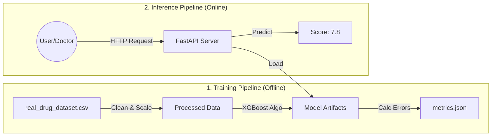

# 🏥 Patient Treatment Outcome Prediction - MLOps Project

<div align="center">


**Can we predict how much a patient will improve based on their medication?**
*A production-grade Machine Learning system built with MLOps best practices.*

</div>

---

## Introduction (Start Here!)

Welcome! This project is a complete **MLOps (Machine Learning Operations)** system. It's not just a script that trains a model; it's a full production engine that simulates how companies like Netflix or Uber deploy AI.

### What does this project do?

Imagine a doctor prescribes a drug (like *Metoprolol*) to a patient. We want to know: **"How much will this patient improve?"**
This system takes patient data (Age, Gender, Drug Name, Side Effects) and predicts a numerical **Improvement Score** (0-10).

### Why is this "MLOps" and not just "Data Science"?

Data Science is experimental (cooking in the kitchen). MLOps is industrial (running a factory). This project includes:

1. **Data Versioning (DVC)**: We track data changes like code. If the data changes, we know exactly when and why.
2. **Reproducibility**: Anyone can run `dvc repro` and get *exactly* the same model result.
3. **Microservices**: The AI runs in a container (Docker), isolated from your computer's mess.
4. **Scalability**: Logic to run on Kubernetes (K8s), meaning it can handle 1 user or 1 million users.

---

## 🏗️ System Architecture

Here is how the data flows through our system.



---

## 🚀 Quick Start Guide

Follow these steps exactly to run the project on your machine.

### Prerequisites (What you need installed)

Before finding the "run" button, make sure you have:

1. **Python 3.9+**: The programming language we use.
2. **Git**: To download this code.
3. **Docker** (Optional but recommended): To run the app in a container.

### Step 1: Clone the Repository

Open your terminal (Command Prompt/Terminal) and run:

```bash
git clone https://github.com/iammohith/Patient-Treatment-Outcome-Prediction-MLOps-Project.git
cd Patient-Treatment-Outcome-Prediction-MLOps-Project
```

### Step 2: Install Python Libraries

We need "dependencies" (tools) like pandas and fastapi.

```bash
pip install -r requirements.txt
```

### Step 3: Run the AI Pipeline (Reproduce Model)

We use **DVC** to run the pipeline. This command will:

1. Read `data/raw/real_drug_dataset.csv`.
2. Clean the data and turn words into numbers (Preprocessing).
3. Train the Machine Learning model.
4. Save the model to `models/model.joblib`.

Execute this:

```bash
dvc repro
```

*You should see output saying "Running stage 'train'..." and "Model saved".*

### Step 4: Start the API Server

Now we turn our model into a web service so apps can talk to it.

```bash
# We set a dummy API Key for local testing
export API_KEY="secret-token"

# Start the server
uvicorn src.api.main:app --reload
```

*If you see "Application startup complete", it's working!*

### Step 5: Open the App

1. Open your web browser (Chrome/Safari).
2. Go to file path usually located at: `web/index.html` (Double click the file in your file explorer).
    * *Note: In a real deployment, this would be served by Nginx.*
3. Enter some dummy data (e.g., Age: 45, Drug: Metoprolol).
4. Click **Predict Outcome**. You should see a score appear!

---

## API Documentation

For developers who want to use code to get predictions.

**Base URL**: `http://localhost:8000`
**Authentication**: Required Header `X-API-Key: secret-token`

### `POST /predict`

Send patient details to get a prediction.

**Request Body (JSON):**

```json
{
  "Age": 45,
  "Gender": "Male",
  "Condition": "Hypertension",
  "Drug_Name": "Metoprolol",
  "Dosage_mg": 50,
  "Treatment_Duration_days": 30,
  "Side_Effects": "Dizziness"
}
```

**Response (JSON):**

```json
{
  "Improvement_Score": 7.62,
  "Model_Version": "v1"
}
```

### `GET /metrics`

Get system health data (for Prometheus).
* `request_count`: How many people used the API.
* `request_latency_seconds`: How fast the API is.

---

## Technical Details (Under the Hood)

### 1. Data Version Control (DVC)

We don't just "save" files. We track them.
* **`dvc.yaml`**: The recipe file. It tells DVC "First, run `preprocess.py`. If that works, run `train.py`."
* **`dvc.lock`**: The proof. It records the exact "fingerprint" (hash) of the data used to train the model.

### 2. Monitoring & Logging

We don't use `print("hello")`. We use structured logs.
* **Logs**: Show *Time*, *Severity*, and *Message*. Example: `INFO - Prediction success. Score: 7.6`.
* **Metrics**: We count every request so we can make dashboards later.

### 3. Docker (Containerization)

We built three "boxes" (Containers) for our code so it runs the same on your laptop as it does on a massive server.
* **`docker/api/Dockerfile`**: The Brain (Python + Model).
* **`docker/web/Dockerfile`**: The Face (Nginx + HTML).
* **`docker/train/Dockerfile`**: The Gym (Training environment).

### 4. Kubernetes (K8s)

If 100,000 doctors used this at once, a single computer would return 503 Crashed.
Kubernetes splits the work across many computers.
* **`k8s/api.yaml`**: Tells K8s "Please run 2 copies of the API, and give them 512MB of RAM each."
* **`k8s/web.yaml`**: Tells K8s "Put the website on the internet with a Load Balancer."

---

## 🛳️ Deployment Instructions

### Option 1: Docker (Local / Easy)

Build the images yourself:

```bash
docker build -f docker/api/Dockerfile -t drug-prediction-api:latest .
docker build -f docker/web/Dockerfile -t drug-prediction-web:latest .
```

### Option 2: Kubernetes (Production / Hard)

1. Start Minikube or connect to a cluster.
2. Apply the configuration:

    ```bash
    kubectl apply -f k8s/api.yaml
    kubectl apply -f k8s/web.yaml
    ```

3. Find your service IP:

    ```bash
    kubectl get services
    ```

---

## ❓ Troubleshooting (Help!)

**Q: I get "Model not loaded" error.**
A: Did you run `dvc repro`? The model is created during training. The API needs the file `models/model.joblib` to exist.

**Q: browser can't connect to API.**
A: Ensure the API is running (`uvicorn ...`) and listening on port 8000. If using Docker, check your port mapping (`-p 8000:8000`).

**Q: Permission denied error.**
A: check `chmod +x` on scripts or ensure you aren't running as a restricted user inappropriately.

---

## License

This project is licensed under the **MIT License**. You can use it, change it, and sell it, as long as you keep the copyright notice.

<div align="center">
Built with ❤️ by an MLOps Engineer.
</div>
