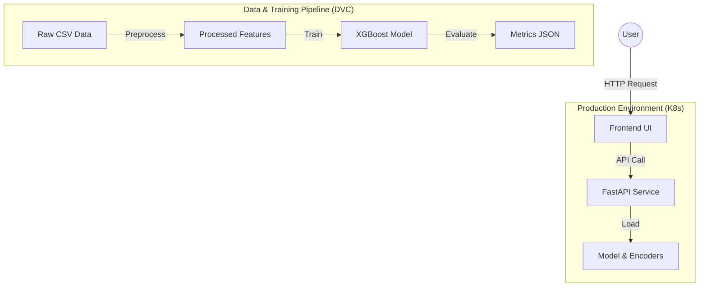

# Patient Treatment Outcome Prediction MLOps Pipeline

<div align="center">


**A production-ready MLOps system for pharmaceutical drug outcome analysis.**
*Data Versioning • Automated Pipelines • Scalable Inference • Observability*

</div>

---

## 📖 Overview

This project implements an end-to-end Machine Learning Operations (MLOps) pipeline designed to predict patient **Improvement Scores** based on pharmaceutical treatment data. It serves as a reference architecture for deploying ML models in a regulated, high-availability environment.

The system ingests patient data (demographics, drug details, side effects), processes it through a reproducible DVC pipeline, trains an XGBoost regressor, and serves predictions via a secured, observable REST API.

### Key Features

- **Reproducibility**: DVC (Data Version Control) tracks datasets, models, and metrics.
- **Scalability**: Dockerized microservices orchestrated via Kubernetes ensuring horizontal scaling.
- **Security**: API Key authentication (Header-based) and non-root container execution.
- **Observability**: Prometheus metrics (`/metrics`) and structured JSON logging.
- **Performance**: High-performance XGBoost inference served via FastAPI/Uvicorn.

---

## 🏗️ Architecture



## 📂 Project Structure

```text
├── data/                # DVC-tracked data storage
│   ├── raw/             # Raw dataset (immutable)
│   └── processed/       # Feature engineered datasets
├── src/                 # Source code
│   ├── data/            # Preprocessing logic
│   ├── train/           # Model training & evaluation
│   └── api/             # FastAPI application
├── models/              # Serialized artifacts (Joblib)
├── docker/              # Container definitions
├── k8s/                 # Kubernetes manifests
├── web/                 # Modern HTML/JS Frontend
└── dvc.yaml             # DVC Pipeline stages
```

## 🚀 Getting Started

### Prerequisites

- **Python 3.9+**
- **Docker** & **Docker Compose** (optional)
- **Kubernetes** (Minikube / Kind / EKS)
- **DVC** (`pip install dvc`)

### 1️⃣ Installation

Clone the repository and install dependencies:

```bash
git clone https://github.com/iammohith/Patient-Treatment-Outcome-Prediction-MLOps-Project.git
cd Patient-Treatment-Outcome-Prediction-MLOps-Project
pip install -r requirements.txt
```

### 2️⃣ Reproduce the Pipeline (DVC)

The entire ML workflow is managed by DVC. To reproduce the model from raw data:

```bash
dvc repro
```

**What happens under the hood:**

1. **Preprocess**: Cleans raw CSV, applies Label Encoding & Scaling.
2. **Train**: Trains XGBoost Regressor on processed data.
3. **Evaluate**: Generates `metrics.json` (RMSE/MAE).

### 3️⃣ Run Locally

Start the API and Frontend locally:

**API** (Runs on port 8000):

```bash
# Set API Key for local dev
export API_KEY="secret-token"
uvicorn src.api.main:app --reload
```

**Frontend**:
Open `web/index.html` in your browser.

---

## 🛠️ API Documentation

The API is secured with an API Key.
**Header**: `X-API-Key: secret-token`

### `POST /predict`

Predicts patient improvement score.

**Payload:**

```json
{
  "Age": 45,
  "Gender": "Male",
  "Condition": "Hypertension",
  "Drug_Name": "Metoprolol",
  "Dosage_mg": 50,
  "Treatment_Duration_days": 30,
  "Side_Effects": "Dizziness"
}
```

**Response:**

```json
{
  "Improvement_Score": 7.6,
  "Model_Version": "v1"
}
```

---

## 📦 Deployment

### Docker

Build optimized production images:

```bash
docker build -f docker/api/Dockerfile -t drug-prediction-api:latest .
docker build -f docker/web/Dockerfile -t drug-prediction-web:latest .
```

### Kubernetes

Deploy to your cluster with resource limits and health checks:

```bash
kubectl apply -f k8s/api.yaml
kubectl apply -f k8s/web.yaml
```

---

## 🔍 Observability

- **Health Check**: `GET /health` - Readiness probe for K8s.
- **Metrics**: `GET /metrics` - Prometheus endpoint tracking:
  - `request_count`: Throughput by status code.
  - `request_latency_seconds`: Latency histograms.

---

## 🛡️ License

This project is licensed under the MIT License - see the LICENSE file for details.
